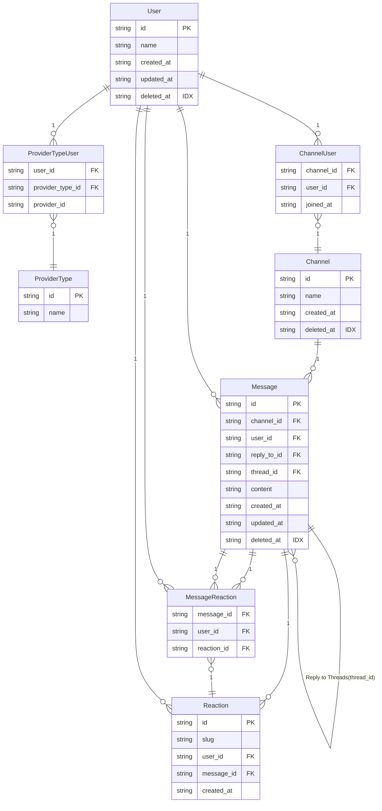

# Melineのドメインモデル設計

MelineはDiscordのようなグループチャットサービスを提供するWebアプリケーションです。

## ドメインモデル図

> [!WARNING]
> あくまで最終的な完成図です

### 完成図

```mermaid
erDiagram

User {
    string id "PK"
    string name ""
    string created_at ""
    string updated_at ""
    string deleted_at "IDX"
}

ProviderTypeUser {
    string user_id "FK"
    string provider_type_id "FK"
    string provider_id ""
}

ProviderType {
    string id "PK"
    string name ""
}

Channel {
    string id "PK"
    string name ""
    string created_at ""
    string deleted_at "IDX"
}

ChannelUser {
    string channel_id "FK"
    string user_id "FK"
    string joined_at ""
}

Message {
    string id "PK"
    string channel_id "FK"
    string user_id "FK"
    string reply_to_id "FK"
    string thread_id "FK"
    string content ""
    string created_at ""
    string updated_at ""
    string deleted_at "IDX"
}

MessageReaction {
    string message_id "FK"
    string user_id "FK"
    string reaction_id "FK"
}

Reaction {
    string id "PK"
    string slug ""
    string user_id "FK"
    string message_id "FK"
    string created_at ""
}

User ||--o{ ProviderTypeUser : "1"
User ||--o{ ChannelUser : "1"

ProviderTypeUser }o--|| ProviderType : "1"

Channel ||--o{ Message : "1"
ChannelUser }o--|| Channel : "1"

Message }o--|| User : "1"
Message ||--o{ Reaction : "1"
Message ||--o{ Message : "Reply(reply_to_id)"
Message ||--o{ Message : "Reply to Threads(thread_id)"
Message ||--o{ MessageReaction : "1"
Message ||--o{ MessageReaction : "1"

MessageReaction }o--|| User : "1"
MessageReaction }o--|| Reaction : "1"

Reaction }o--|| User : "1"
```
